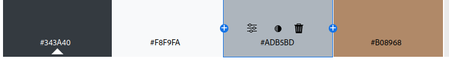
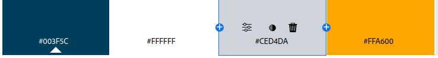
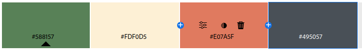
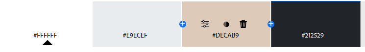
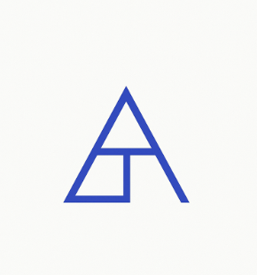

# Proyecto Equipo 1

Este documento reúne las ideas y aportaciones del equipo sobre el proyecto de la primera evaluación.

## Como probar la web (Si Luis esta es tu parte)
La pagina web del proyecto es /Codigo/inicio.html, a partir de ahi ya puedes entrar a todo, lo digo
porque la organización no es nuestro fuerte y te puedes perder

## 🌐 Referencia del profesor
Ejemplo de página web:  
[https://josemanuelmaestrofuentes.com/experiencia/](https://josemanuelmaestrofuentes.com/experiencia/)

## 🎨 Diseño y Figma
Podemos empezar a pensar en:
- Paleta de colores  
- Diseño general (aunque sea un boceto simple)  
- Inspiración visual para las secciones de la web  

## 👥 Reparto de intereses
| Integrante | Comentario |
|-------------|-------------|
| **Daniel** | Puede trabajar en cualquier parte del proyecto. |
| **Alberto** | Prefiere codificar, aunque puede ayudar en Figma. |
| **Adam** | No domina JS, pero puede colaborar en otras áreas. |
| **Alex** | Todo bien excepto Figma. |

## 🏗️ Tema elegido: Estudio de Arquitectura
**Descripción:**  
Una web para mostrar los proyectos de un estudio de arquitectura, destacando sus diseños y servicios.

### Estructura propuesta
- **Inicio:** Presentación breve del estudio con imagen destacada o slider de proyectos.  
- **Proyectos:** Galería de imágenes con descripciones cortas (casas, edificios, interiores).  
- **Servicios:** Lista sencilla de servicios (diseño, asesoría, planificación).  
- **Contacto:** Formulario con nombre, email y mensaje, además de los datos de contacto.  

## Sugerencia de colores(Alberto):

### Opción 1: "Confianza y Sofisticación"

Gris Antracita: #343a40
Blanco Roto: #f8f9fa
Beige Piedra: #adb5bd
Acento Ocre / Coñac: #b08968

### Opción 2: "Creatividad y Vanguardia"

Azul Petróleo Profundo: #003f5c
Blanco Nieve: #ffffff
Gris Cemento Claro: #ced4da
Acento Amarillo Eléctrico: #ffa600

### Opción 3: "Sostenible y Humana"

Verde Musgo: #588157
Crema / Lino: #fdf0d5
Terracota Suave: #e07a5f
Gris Pizarra: #495057

### Opción 4: "Minimalismo Nórdico"

Blanco Puro: #ffffff
Gris Perla: #e9ecef
Madera Clara (Tono representativo): #decab9
Negro Mate: #212529

## Primera correción del cliente

### Logotipo escogido

Pidio que usaramos más el logotipo que esta muy bien

### Cambio en el color principal
El marron no le pareción buena opción asi que decidio cambiar el color a un azul/verde oscuro, además nos dijo de que probaramos el color que usamos para el logo anterior

### Pagina de inicio
Nada de proyectos pequeños uno grande que tenga 6/7 imagenes rotativas como si fuera una galeria

### Proyectos
El recuadro de cada proyecto se hace en gris, cambiando el marron por el f4f4f4 que tenemos
Además mucho texto, que sea algo sencillo y descriptivo
Fotos más en grande y menos texto para darle importancia a lo visual

### Servicio 
Tiene que ser mas formal, lo ve algo poco profesional y que no es lo que busca
Además que cuando vas bajando las tarjetas van apareciendo de los lados

### Contacto
Le gusta el mapa. Divide el texto en parrafos y justificado, nada de centrado

